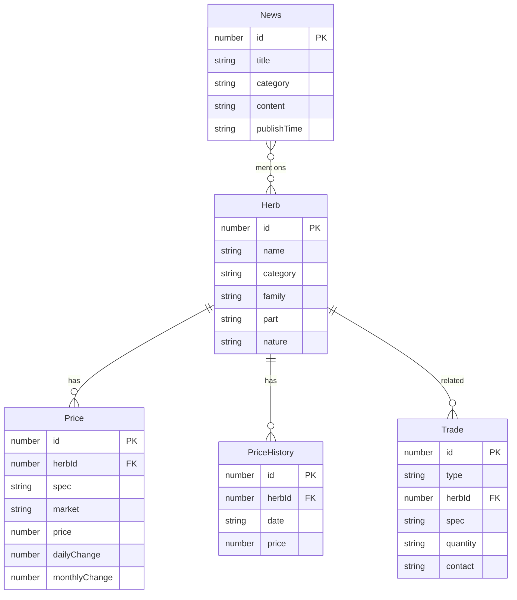

## 1. 架构设计

```mermaid
flowchart TB
    subgraph "前端层"
        "Vue 3 + Vite + Element Plus"
        "Pinia 状态管理"
        "ECharts 图表"
        "Leaflet 地图"
    end
    subgraph "数据层"
        "Mock数据服务"
        "本地JSON数据"
    end
    "前端层" --> "数据层"
```

本项目为前端展示原型，使用Mock数据模拟后端接口，后续可对接Spring Boot后端。

## 2. 技术说明

- **前端框架**：Vue 3 + TypeScript + Vite
- **UI组件库**：Element Plus
- **状态管理**：Pinia
- **图表库**：ECharts 5
- **地图库**：Leaflet + vue-leaflet
- **路由**：Vue Router 4
- **HTTP客户端**：Axios（预留，当前使用Mock数据）
- **样式方案**：Tailwind CSS + Element Plus主题定制
- **初始化工具**：vite-init (vue-ts模板)

## 3. 路由定义

| 路由 | 用途 |
|------|------|
| / | 首页 - 行情概览、涨跌排行、快讯、供求推荐 |
| /market | 行情中心 - 市场价格、产地价格 |
| /market/history | 历史价格 - 品种价格走势查询 |
| /herb/:id | 品种详情 - 单品种完整信息页 |
| /news | 资讯中心 - 行业资讯列表 |
| /news/:id | 资讯详情 - 文章正文 |
| /trade | 供求大厅 - 供应/求购信息 |
| /trade/publish | 发布供求 |
| /encyclopedia | 药材百科 - 药材知识库 |
| /encyclopedia/:id | 百科详情 - 单品种百科 |
| /data | 数据中心 - 指数、统计、热力图 |
| /user | 用户中心 - 收藏、预警、管理 |

## 4. API定义（Mock数据接口）

```typescript
interface Herb {
  id: number
  name: string
  alias: string[]
  category: string
  family: string
  part: string
  nature: string
  meridian: string[]
  efficacy: string
  contraindication: string
  image: string
}

interface PriceItem {
  herbId: number
  herbName: string
  spec: string
  market: string
  origin: string
  price: number
  prevPrice: number
  dailyChange: number
  monthlyChange: number
  trend: 'up' | 'down' | 'stable'
}

interface PriceHistory {
  herbId: number
  spec: string
  market: string
  dates: string[]
  prices: number[]
}

interface NewsItem {
  id: number
  title: string
  category: string
  summary: string
  content: string
  coverImage: string
  publishTime: string
  viewCount: number
  relatedHerbs: number[]
}

interface TradeItem {
  id: number
  type: 'supply' | 'demand'
  herbName: string
  spec: string
  origin: string
  quantity: string
  price: string
  contact: string
  publishTime: string
  status: 'active' | 'expired'
}

interface MarketIndex {
  date: string
  compositeIndex: number
  herbIndex: number
  animalIndex: number
  mineralIndex: number
}
```

## 5. 项目目录结构

```
src/
├── components/          # 通用组件
│   ├── layout/          # 布局组件（Header, Footer, Sidebar）
│   ├── common/          # 通用业务组件（PriceTag, TrendChart, HerbCard）
│   └── charts/          # 图表组件（LineChart, BarChart, HeatMap）
├── composables/         # 组合式函数（usePrice, useHerb, useTrade）
├── pages/               # 页面组件
│   ├── Home.vue
│   ├── Market.vue
│   ├── MarketHistory.vue
│   ├── HerbDetail.vue
│   ├── News.vue
│   ├── NewsDetail.vue
│   ├── Trade.vue
│   ├── TradePublish.vue
│   ├── Encyclopedia.vue
│   ├── EncyclopediaDetail.vue
│   ├── DataCenter.vue
│   └── UserCenter.vue
├── stores/              # Pinia状态仓库
│   ├── herb.ts
│   ├── price.ts
│   ├── news.ts
│   └── trade.ts
├── mock/                # Mock数据
│   ├── herbs.ts
│   ├── prices.ts
│   ├── news.ts
│   ├── trades.ts
│   └── index.ts
├── router/              # 路由配置
│   └── index.ts
├── utils/               # 工具函数
│   └── format.ts
├── App.vue
└── main.ts
```

## 6. 数据模型


